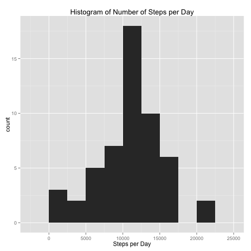
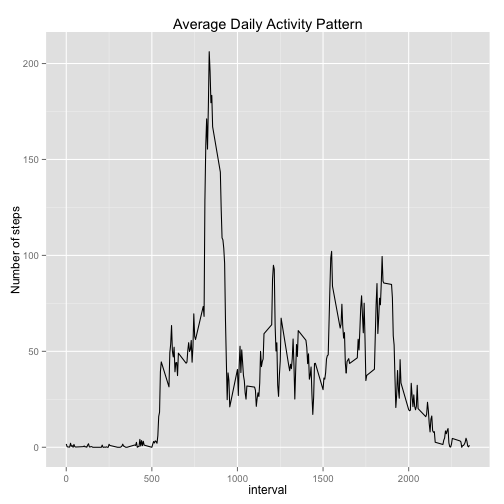
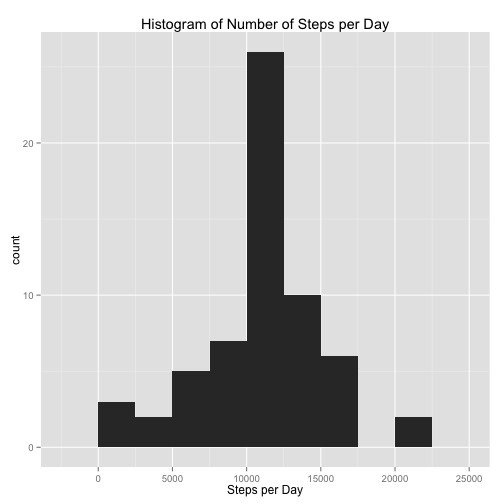
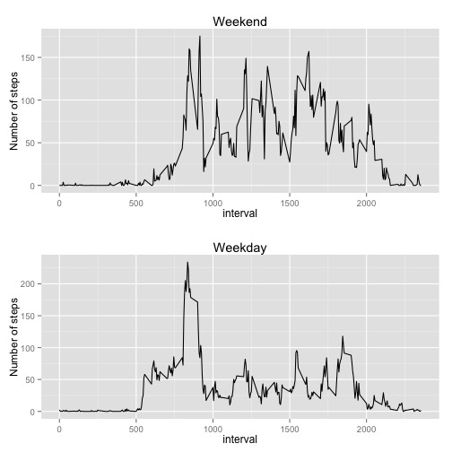

## Loading and preprocessing the data

Loading the data.

```r
data <- read.csv("activity.csv")
```

## What is mean total number of steps taken per day?

1. Making a histogram of the total number of steps taken each day.

```r
library(ggplot2)
dailySteps <- aggregate(steps ~ date, data=data, sum)
hg <- ggplot(dailySteps, aes(x=steps))
hg <- hg + geom_histogram(binwidth=2500)
hg <- hg + labs(title="Histogram of Number of Steps per Day")
hg <- hg + xlab("Steps per Day")
plot(hg)
```

 

2. Calculating the mean and median total number of steps taken per day.

```r
mean(dailySteps$steps)
```

```
## [1] 10766.19
```

```r
median(dailySteps$steps)
```

```
## [1] 10765
```

## What is the average daily activity pattern?

1. Makeing a time series plot of the 5-minute interval (x-axis)
and the average number of steps taken, averaged across all days (y-axis)

```r
stepsPerInterval <- aggregate(steps ~ interval, data=data, mean)
ts <- ggplot(stepsPerInterval, aes(interval, steps))
ts <- ts + geom_line()
ts <- ts + labs(title="Average Daily Activity Pattern")
ts <- ts + ylab("Number of steps")
plot(ts)
```

 

2. Finding which 5-minute interval contains the maximum number of steps.

```r
stepsPerInterval[which.max(stepsPerInterval$steps),]$interval
```

```
## [1] 835
```

## Imputing missing values

1. Calculating the total number of missing values in the dataset.

```r
sum(is.na(data$steps))
```

```
## [1] 2304
```

2. To fill in the missing values, I used the mean for the 5-minute interval.

3. Creating a new dataset that is equal to original dataset
but with the missing values filled in.

```r
datafill <- data
n <- nrow(data)
for (i in 1:n) {
  if(is.na(data[i,]$steps)) {
    datafill[i,]$steps <- stepsPerInterval[((i-1)%%288+1),]$steps
  }
}
```

4. Making a histogram of the total number of steps taken each day.

```r
dailySteps <- aggregate(steps ~ date, data=datafill, sum)
hg <- ggplot(dailySteps, aes(x=steps))
hg <- hg + geom_histogram(binwidth=2500)
hg <- hg + labs(title="Histogram of Number of Steps per Day")
hg <- hg + xlab("Steps per Day")
plot(hg)
```

 

Calculating the mean and median total number of steps taken each day.

```r
mean(dailySteps$steps)
```

```
## [1] 10766.19
```

```r
median(dailySteps$steps)
```

```
## [1] 10766.19
```

## Are there differences in activity patterns between weekdays and weekends?

1. Creating a new factor variable in the dataset with
two levels -- "weekday" and "weekend" indicating whether a given date is
a weekday or weekend day.

```r
data["dayType"] <- ifelse((as.POSIXlt(data$date)$wday==0
                           | as.POSIXlt(data$date)$wday==6),
                          "weekend", "weekday")
head(data)
```

```
##   steps       date interval dayType
## 1    NA 2012-10-01        0 weekday
## 2    NA 2012-10-01        5 weekday
## 3    NA 2012-10-01       10 weekday
## 4    NA 2012-10-01       15 weekday
## 5    NA 2012-10-01       20 weekday
## 6    NA 2012-10-01       25 weekday
```

2. Making a panel plot containing a time series plot of the
5-minute interval (x-axis) and the average number of steps taken,
averaged across all weekday days or weekend days (y-axis).

```r
library(grid)

# Create a plot of the weekend data
weekendStepsPerInterval <- aggregate(steps ~ interval,
                                     data=subset(data, dayType=="weekend"),
                                     mean)
ts1 <- ggplot(weekendStepsPerInterval, aes(interval, steps))
ts1 <- ts1 + geom_line()
ts1 <- ts1 + labs(title="Weekend")
ts1 <- ts1 + ylab("Number of steps")

# Create a plot of the weekday data
weekdayStepsPerInterval <- aggregate(steps ~ interval,
                                     data=subset(data, dayType=="weekday"),
                                     mean)
ts2 <- ggplot(weekdayStepsPerInterval, aes(interval, steps))
ts2 <- ts2 + geom_line()
ts2 <- ts2 + labs(title="Weekday")
ts2 <- ts2 + ylab("Number of steps")

# Layout 2 plots
pushViewport(viewport(layout = grid.layout(2, 1)))
print(ts1, vp = viewport(layout.pos.row = 1, layout.pos.col = 1))
print(ts2, vp = viewport(layout.pos.row = 2, layout.pos.col = 1))
```

 
